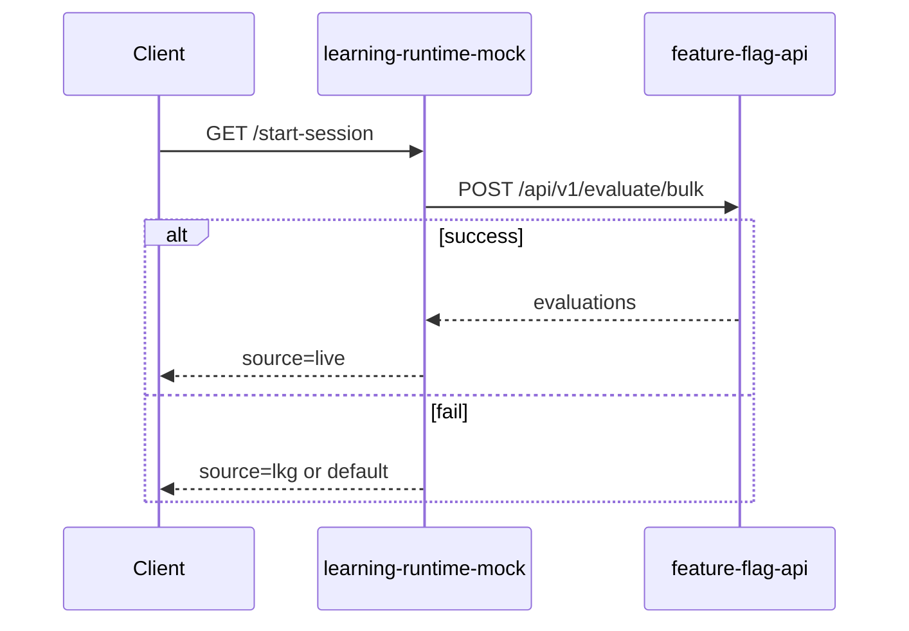

# learning-runtime-mock

Mock AI runtime service that starts a learning session after evaluating feature flags.

## What it does

- `GET /start-session` endpoint 제공
- Feature Flag API의 `/api/v1/evaluate/bulk` 호출
- 결과 실패 시 LKG(last-known-good) fallback
- LKG도 없으면 safe default fallback

Evaluated flags:
- `focus_tracking`
- `brain_monitoring_3d`
- `focus_model_v2`

## Query Parameters

`GET /start-session?instituteId=...&userId=...&plan=basic|premium`

- `instituteId` (required)
- `userId` (required)
- `plan` (optional, default `basic`)

## Environment Variables

```env
PORT=3000
FEATURE_FLAG_API_URL=http://localhost:3000
API_KEY=replace-with-api-key
LKG_MAX_AGE_MS=300000
```

## Run

```bash
npm install
npm run dev
```

Build + start:

```bash
npm run build
npm start
```

## Sample Request

```bash
curl "http://localhost:3000/start-session?instituteId=institute_123&userId=student_42&plan=premium"
```

## Architecture


